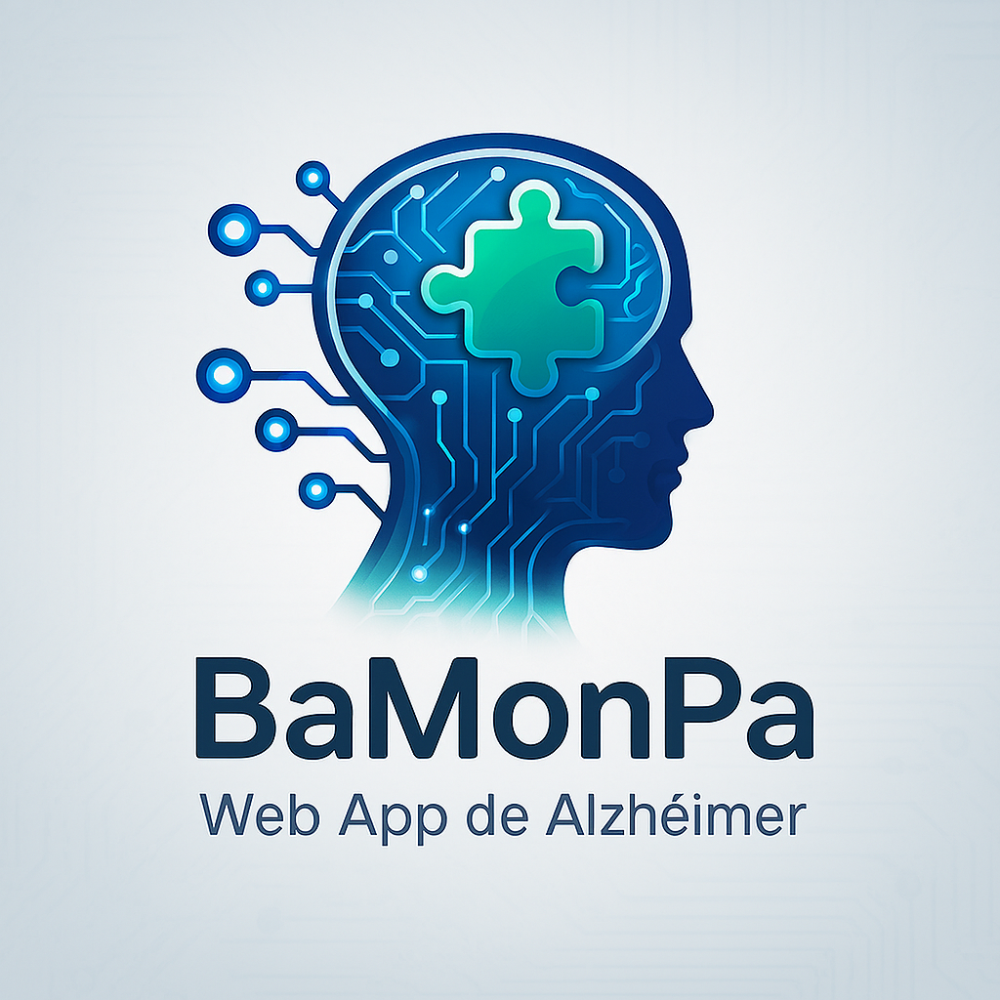

# 🧠 DoURemember - Sistema de Apoyo para Pacientes con Alzheimer



**DoURemember** es una aplicación web integral diseñada para brindar apoyo a pacientes con Alzheimer, sus cuidadores y profesionales médicos. La plataforma facilita la gestión de recuerdos, seguimiento médico, evaluaciones cognitivas y comunicación entre todos los involucrados en el cuidado del paciente.

---

## 📋 Tabla de Contenidos

- [Características Principales](#-características-principales)
- [Tecnologías Utilizadas](#-tecnologías-utilizadas)
- [Arquitectura del Proyecto](#-arquitectura-del-proyecto)
- [Requisitos Previos](#-requisitos-previos)
- [Instalación](#-instalación)
- [Configuración](#-configuración)
- [Uso](#-uso)
- [Roles de Usuario](#-roles-de-usuario)
- [Estructura del Proyecto](#-estructura-del-proyecto)
- [Funcionalidades por Módulo](#-funcionalidades-por-módulo)
- [Firebase & Firestore](#-firebase--firestore)
- [API de OpenAI](#-api-de-openai)
- [Contribución](#-contribución)
- [Licencia](#-licencia)

---

## ✨ Características Principales

### 🏥 **Para Doctores**
- Dashboard centralizado con información de pacientes
- Gestión de pacientes y sus historiales
- Generación de pruebas cognitivas personalizadas con IA
- Visualización de resultados de evaluaciones
- Galería de recuerdos de pacientes
- Sistema de reportes médicos
- Invitación de cuidadores mediante email

### 👨‍👩‍👧 **Para Cuidadores**
- Gestión de miembros familiares/pacientes
- Subida y organización de recuerdos (fotos con descripciones)
- Visualización de galería de recuerdos
- Generación de tests cognitivos
- Seguimiento del progreso del paciente
- Sistema de recordatorios

### 🧑‍🦳 **Para Pacientes**
- Galería personalizada de recuerdos
- Realización de pruebas cognitivas interactivas
- Visualización de resultados históricos
- Sistema de recordatorios personalizados
- Perfil con información personal

---

## 🛠️ Tecnologías Utilizadas

### **Frontend**
- **React 19** - Biblioteca de interfaz de usuario
- **TypeScript** - Superset de JavaScript con tipado estático
- **Vite** - Build tool y dev server ultra-rápido
- **React Router DOM** - Enrutamiento declarativo
- **CSS3** - Estilos personalizados con diseño moderno

### **Backend & Servicios**
- **Firebase Authentication** - Sistema de autenticación de usuarios
- **Cloud Firestore** - Base de datos NoSQL en tiempo real
- **Firebase Storage** - Almacenamiento de imágenes y archivos
- **OpenAI API (GPT-4)** - Generación inteligente de pruebas cognitivas
- **EmailJS** - Servicio de envío de correos electrónicos

### **Herramientas de Desarrollo**
- **ESLint** - Linting de código
- **TypeScript Compiler** - Compilación y verificación de tipos
- **Git** - Control de versiones

---

## 🏗️ Arquitectura del Proyecto

```
DoURemember
├── Capa de Presentación (React + TypeScript)
│   ├── Componentes de UI
│   ├── Páginas por rol
│   └── Enrutamiento
│
├── Capa de Lógica de Negocio
│   ├── Servicios de API
│   ├── Contextos de autenticación
│   └── Hooks personalizados
│
├── Capa de Datos
│   ├── Firebase Authentication
│   ├── Cloud Firestore
│   └── Firebase Storage
│
└── Servicios Externos
    ├── OpenAI API
    └── EmailJS
```

---

## 📦 Requisitos Previos

Antes de comenzar, asegúrate de tener instalado:

- **Node.js** (v18 o superior)
- **npm** o **yarn**
- **Git**
- Cuenta de **Firebase**
- API Key de **OpenAI**
- Cuenta de **EmailJS** (opcional, para invitaciones)

---

## 🚀 Instalación

### 1. Clonar el Repositorio

```bash
git clone https://github.com/JuanjoMM835/ProyectoPI.git
cd ProyectoPI
```

### 2. Instalar Dependencias

```bash
npm install
```

### 3. Configurar Variables de Entorno

Crea un archivo `.env` en la raíz del proyecto:

```env
# Firebase Configuration
VITE_FIREBASE_API_KEY=tu_api_key
VITE_FIREBASE_AUTH_DOMAIN=tu_auth_domain
VITE_FIREBASE_PROJECT_ID=tu_project_id
VITE_FIREBASE_STORAGE_BUCKET=tu_storage_bucket
VITE_FIREBASE_MESSAGING_SENDER_ID=tu_messaging_sender_id
VITE_FIREBASE_APP_ID=tu_app_id

# OpenAI Configuration
VITE_OPENAI_API_KEY=tu_openai_api_key
```

**⚠️ IMPORTANTE:** Nunca subas el archivo `.env` a Git. Asegúrate de que esté en `.gitignore`.

---

## ⚙️ Configuración

### Firebase Setup

1. Ve a [Firebase Console](https://console.firebase.google.com/)
2. Crea un nuevo proyecto
3. Habilita **Authentication** (Email/Password)
4. Crea una base de datos **Firestore**
5. Configura **Storage** para imágenes
6. Copia las credenciales al archivo `.env`

### Firestore Rules

Aplica las reglas de seguridad desde `src/firebase/firebase.rules` en la consola de Firebase.

### OpenAI API

1. Obtén tu API key en [OpenAI Platform](https://platform.openai.com/api-keys)
2. Agrégala al archivo `.env`
3. Consulta `OPENAI_SETUP_GUIDE.md` para más detalles

### EmailJS (Opcional)

Para el sistema de invitaciones:
1. Crea cuenta en [EmailJS](https://www.emailjs.com/)
2. Configura un servicio de email
3. Actualiza `src/api/emailService.ts` con tus credenciales
4. Consulta `EMAILJS_SETUP.md` para instrucciones detalladas

---

## 🎮 Uso

### Desarrollo

```bash
npm run dev
```

La aplicación estará disponible en `http://localhost:5173`

### Compilación para Producción

```bash
npm run build
```

Los archivos optimizados se generarán en la carpeta `dist/`

### Preview de Producción

```bash
npm run preview
```

### Linting

```bash
npm run lint
```

---

## 👥 Roles de Usuario

### 🩺 Doctor
- Acceso completo a información de pacientes
- Gestión de evaluaciones cognitivas
- Generación de reportes médicos
- Invitación de cuidadores

### 👨‍👩‍👧 Cuidador (Caregiver)
- Gestión de pacientes asignados
- Administración de recuerdos
- Seguimiento del progreso
- Comunicación con doctores

### 🧑‍🦳 Paciente
- Acceso a galería personal
- Realización de pruebas
- Visualización de recordatorios
- Consulta de perfil

---

## 📁 Estructura del Proyecto

```
ProyectoPI/
├── public/              # Archivos públicos estáticos
├── src/
│   ├── api/            # Servicios de API
│   │   ├── authService.ts
│   │   ├── patientService.ts
│   │   ├── memoryService.ts
│   │   ├── testService.ts
│   │   ├── aiTestService.ts
│   │   ├── emailService.ts
│   │   └── invitationService.ts
│   │
│   ├── assets/         # Imágenes y recursos
│   │   └── brain-logo.png
│   │
│   ├── auth/           # Lógica de autenticación
│   │   ├── AuthContext.tsx
│   │   ├── ProtectedRoute.tsx
│   │   ├── useAuth.ts
│   │   └── useAuthState.ts
│   │
│   ├── components/     # Componentes reutilizables
│   │   ├── Navbar.tsx
│   │   ├── MemoryCard.tsx
│   │   └── PatientProfileModal.tsx
│   │
│   ├── firebase/       # Configuración de Firebase
│   │   ├── firebase.ts
│   │   └── firebase.rules
│   │
│   ├── layout/         # Layouts de la aplicación
│   │   └── MainLayout.tsx
│   │
│   ├── modules/        # Módulos por rol
│   │   ├── auth/       # Login y Register
│   │   ├── doctor/     # Funcionalidades del doctor
│   │   ├── caregiver/  # Funcionalidades del cuidador
│   │   ├── patient/    # Funcionalidades del paciente
│   │   └── test/       # Sistema de pruebas
│   │
│   ├── routes/         # Configuración de rutas
│   │   └── AppRouter.tsx
│   │
│   ├── types/          # Definiciones de tipos TypeScript
│   │   ├── Memory.ts
│   │   └── Test.ts
│   │
│   ├── App.tsx         # Componente principal
│   ├── main.tsx        # Punto de entrada
│   └── index.css       # Estilos globales
│
├── .env                # Variables de entorno (NO SUBIR A GIT)
├── .gitignore          # Archivos ignorados por Git
├── package.json        # Dependencias y scripts
├── tsconfig.json       # Configuración de TypeScript
├── vite.config.ts      # Configuración de Vite
└── README.md           # Este archivo
```

---

## 🎯 Funcionalidades por Módulo

### Módulo de Autenticación
- Registro de usuarios con roles
- Login con email y contraseña
- Verificación de email
- Rutas protegidas por rol
- Persistencia de sesión

### Módulo de Doctores
- **Dashboard**: Vista general de pacientes
- **Pacientes**: Lista y gestión de pacientes
- **Pruebas**: Generación con IA y evaluación
- **Reportes**: Análisis de progreso
- **Galería**: Recuerdos de pacientes
- **Invitaciones**: Sistema de invitación de cuidadores

### Módulo de Cuidadores
- **Familia**: Gestión de miembros
- **Recuerdos**: Subida y organización
- **Galería**: Visualización de recuerdos
- **Pruebas**: Generación de tests
- **Perfil**: Información del paciente

### Módulo de Pacientes
- **Home**: Dashboard personalizado
- **Galería**: Recuerdos con descripción
- **Pruebas**: Realización de evaluaciones
- **Recordatorios**: Eventos importantes
- **Perfil**: Información personal

---

## 🔥 Firebase & Firestore

### Colecciones de Firestore

#### `users`
```typescript
{
  uid: string;
  name: string;
  email: string;
  role: "patient" | "doctor" | "caregiver";
  createdAt: Timestamp;
  patientIds?: string[];      // Para caregivers
  caregiverIds?: string[];    // Para patients
}
```

#### `memories`
```typescript
{
  id: string;
  patientId: string;
  imageUrl: string;
  description: string;
  uploadedBy: string;
  createdAt: Timestamp;
}
```

#### `tests`
```typescript
{
  id: string;
  patientId: string;
  createdBy: string;
  questions: Question[];
  results?: TestResult;
  createdAt: Timestamp;
  completedAt?: Timestamp;
}
```

#### `reminders`
```typescript
{
  id: string;
  patientId: string;
  title: string;
  description: string;
  date: Timestamp;
  completed: boolean;
}
```

#### `invitations`
```typescript
{
  token: string;
  doctorId: string;
  doctorName: string;
  caregiverEmail: string;
  patientId: string;
  patientName: string;
  status: "pending" | "accepted" | "expired";
  createdAt: Timestamp;
  expiresAt: Timestamp;
}
```

---

## 🤖 API de OpenAI

El sistema utiliza **GPT-4** para generar pruebas cognitivas personalizadas:

- **Modelo**: `gpt-4o-mini`
- **Temperatura**: 0.7 (creatividad moderada)
- **Tokens máximos**: 3000
- **Formato**: JSON estructurado

### Tipos de Preguntas Generadas

1. **Memoria a corto plazo**
2. **Orientación temporal**
3. **Reconocimiento de objetos**
4. **Secuencias lógicas**
5. **Cálculo básico**

Consulta `AI_TEST_SETUP.md` para más información.

---

## 🤝 Contribución

Las contribuciones son bienvenidas. Por favor:

1. Haz fork del proyecto
2. Crea una rama para tu feature (`git checkout -b feature/AmazingFeature`)
3. Commit tus cambios (`git commit -m 'Add some AmazingFeature'`)
4. Push a la rama (`git push origin feature/AmazingFeature`)
5. Abre un Pull Request

### Estándares de Código

- Usa **TypeScript** para todo el código
- Sigue las convenciones de nombres de React
- Escribe componentes funcionales con hooks
- Documenta funciones complejas
- Ejecuta `npm run lint` antes de commit

---

## 📄 Licencia

Este proyecto es parte de un **Proyecto Informático** de la **Universidad Autónoma de Occidente (UAO)**.

---

## 👨‍💻 Equipo de Desarrollo

- **Juan Palacios** - Desarrollo Full Stack
- **Universidad Autónoma de Occidente** - Supervisión académica

---

## 📞 Contacto

- **GitHub**: [@JuanjoMM835](https://github.com/JuanjoMM835)
- **Repositorio**: [ProyectoPI](https://github.com/JuanjoMM835/ProyectoPI)

---

## 🙏 Agradecimientos

- Firebase por la infraestructura backend
- OpenAI por la API de generación de pruebas
- React y Vite por las herramientas de desarrollo
- La comunidad de código abierto

---

## 📚 Documentación Adicional

- [Configuración de OpenAI](OPENAI_SETUP_GUIDE.md)
- [Configuración de EmailJS](EMAILJS_SETUP.md)
- [Solución de Errores](SOLUCION_ERROR_CUOTA.md)
- [Guía de Pruebas con IA](AI_TEST_SETUP.md)

---

<div align="center">

**Hecho con ❤️ para mejorar la calidad de vida de pacientes con Alzheimer**

🧠 **DoURemember** - _Porque los recuerdos importan_

</div>
